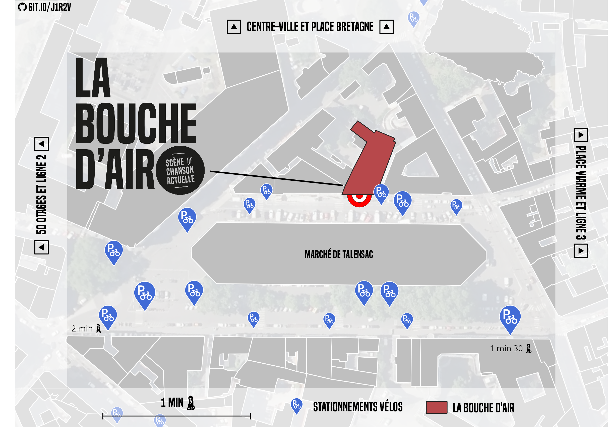

# Bicycle parking map
Static map to show bicycle parking spot around a specific place shared in [GitHub](https://github.com/CorentinLemaitre/bicycle_parking_map). 

The goal of this repository is to help produce a map of the bicycle parking to access a specific place. The use case is the [Salle Paul Fort](https://www.openstreetmap.org/node/4484128529) in Nantes. The map is made to be shown in the nearest bicyle parking spot and help people to find one free nearby. 

Here is the result of the process for this use case :



## Context

The map is produced with the software **QGIS** and it is based on **OpenStreetMap** data. The strucutre is made to be updated easily. 

If you know that bicycle parking are created or modified please contribute to OpenStreetMap. [Here you can find the documentation to do it](https://wiki.openstreetmap.org/wiki/Tag:amenity%3Dbicycle_parking).

# Step by step 

## Download bicycle_parking.geojson

The localisation of bicycle parking will be extracted from OpenStreetMap data. The tool Overpass turbo help you to do this. Use a web browser to go to [overpass-turbo](https://overpass-turbo.eu/s/1cRd), then zoom in the place where you want to map bicycle parking. 

Add this overpass querry in the dialog and execute it. 

```
[out:xml] [timeout:25];
(
    node["amenity"="bicycle_parking"](around:1000, {{center}});
    way["amenity"="bicycle_parking"](around:1000, {{center}});
    relation["amenity"="bicycle_parking"](around:1000, {{center}});
);
out center;
```

Save the result as `bicycle_parking.geojson` to replace the old file.

To give information about distance we need isochrone from openrouteservice. Here is a [link for salle paul fort](https://classic-maps.openrouteservice.org/reach?n1=47.221142&n2=-1.558111&n3=17&a=47.220909,-1.558231&b=2&i=0&j1=10&j2=2&undefined=1&k1=en-US&k2=km). Download the file produced and name it `ors-export-polygon.geojson` to replace the existing one.

## Define the styling rules

The goal is to define a style to show bicycle parking nearby. 

The zoom tend to be the closest possible zoom. 

There is a filter to set to show only accessible bicycle parking, for example there is some private or some that needs a specific card to access. 

## Adapt the layout to your context

To keep a ligth map there is few layers used in QGIS. All information about the direction and orientation must be given by hand in the layout side panel. Icon can be modified to get your own result. They are all in the `icon/` folder.
